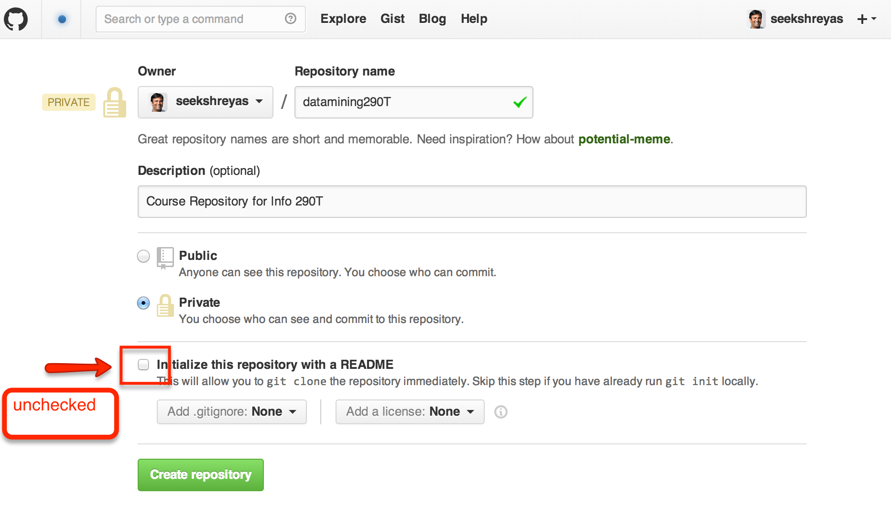

Notes for Setting up Git/Github 
===============================

Link to my [presentation on Git/Github] on SpeakerDeck


Please find below instructions for the following tasks

1. Install & set up Git
2. Configure Github and access the course repository


## Install & set up git

You can install git using the binaries available for download at [git-scm.com/downloads](http://git-scm.com/downloads)


Next, configure your Git with necessary/reasonable defaults, by running it on your terminal/command prompt/power shell

```
$ git config --global user.name <YOUR NAME>
$ git config --global user.email <YOUR EMAIL ADDRESS>
```

Also, it might be helpful if you ran this:
```
$ git config --global push.default current
```

which ensures that when you push it takes the current branch by default.

Once installed proceed to set up your Github

## Configure Github

1. Request an educational account from github : [github.com/edu](https://github.com/edu)
2. Set up your SSH keys for your account
    1. Go to `Account Settings > SSH Keys` [github.com/settings/ssh](https://github.com/settings/ssh) to view/create SSH keys, for your machine. 
        1. To create your SSH key, follow the [Generating SSH Key] instructions
3. Clone [Course Repository] on your workspace machine (it is up to you to use ISchool server machine or your local machine)
    1. Go to [Course Repository] page, and copy the repository url. Make sure you are copying the SSH version of the url. 
        1. It should be : `git@github.com:jretz/datamining290.git`
    2. Create __your__ own Github repository for doing the course work.
        - Click on `New Repository` button and fill in the details, as shown in the figure
        - Make your repository __Private__
        - Make sure you __UNCHECK__ the __Initialize the repository with a README file__, and also leave the __Ignore Files__ and __License File__ checkboxes as __NONE__ (as shown in the figure)
        - 
        - __Copy your Github repository URL__. Lets call it `<YOUR_GH_REPO_URL>`
        - Add Jimmy (`@jretz`) and Me (`@seekshreyas`) as __collaborators__ in your private repository, so we can see your files.
            - You can add collaborators at: `Repo Settings > Collaborators`
            - 
            
    3. Open your terminal (on Mac/Linux) or powershell (on Windows), and navigate to the desired folder/directory where you would like to download and set up the course repository. Then,
        - __Clone__ the repository on your machine
            - `$ git clone git@github.com:jretz/datamining290.git <FOLDERNAME (optional)>`
        - __Navigate__ to the repository folder
            - `$ cd <FOLDERNAME>`
        - __Update__ the remotes of the the repository.
            - __Check__ the current remotes first
                - `$ git remote -v`
                - It should look something like this:
                    <pre>
                    jimmy   git@github.com:jretz/datamining290.git (fetch)
                    jimmy   git@github.com:jretz/datamining290.git (push)
                    </pre>
            - __Modify__ the remotes:
                ```
                $ git remote rename origin jimmy
                $ git remote add origin <YOUR_GH_REPO_URL>
                ```
            - __Check__ the remotes again, with `$ git remote -v` command. It should show something like this:
                
                ```
                jimmy   git@github.com:jretz/datamining290.git (fetch)
                jimmy   git@github.com:jretz/datamining290.git (push)
                origin  git@github.com:seekshreyas/datamining290T.git (fetch)
                origin  git@github.com:seekshreyas/datamining290T.git (push)
                ```


Thats it you have successfully set up the course repository on your machine.


## Further Git Resources
Following links are useful as Git resources
- Quick [Git Command Reference]
- Detailed [Git Reference]
- Git Book: [Pro Git]


## For advanced git users
Some sensible configurations, shortcuts and aliases. I leave to the individuals to figure out themselves on how to implement them.

### Configurations

#### `.gitconfig` file settings

```
[alias]

    # View the SHA, description, and history graph of the latest 20 commits
    l = log --pretty=oneline -n 20 --graph

    # View the current working tree status using the short format
    s = status -s

    # Show the diff between the latest commit and the current state
    d = !"git diff-index --quiet HEAD -- || clear; git diff --patch-with-stat"

    # Clone a repository including all submodules
    c = clone --recursive

[color]
    # Use colors in Git commands that are capable of colored output when outputting to the terminal
    ui = auto


[merge]
    # Include summaries of merged commits in newly created merge commit messages
    log = true
```


[presentation on Git/Github]: https://speakerdeck.com/seekshreyas/introduction-to-git-and-github
[Course Repository]: https://github.com/jretz/datamining290
[Generating SSH Key]: https://help.github.com/articles/generating-ssh-keys
[Git Command Reference]: http://gitref.org
[Git Reference]: http://git-scm.com
[Pro Git]: http://git-scm.com/book