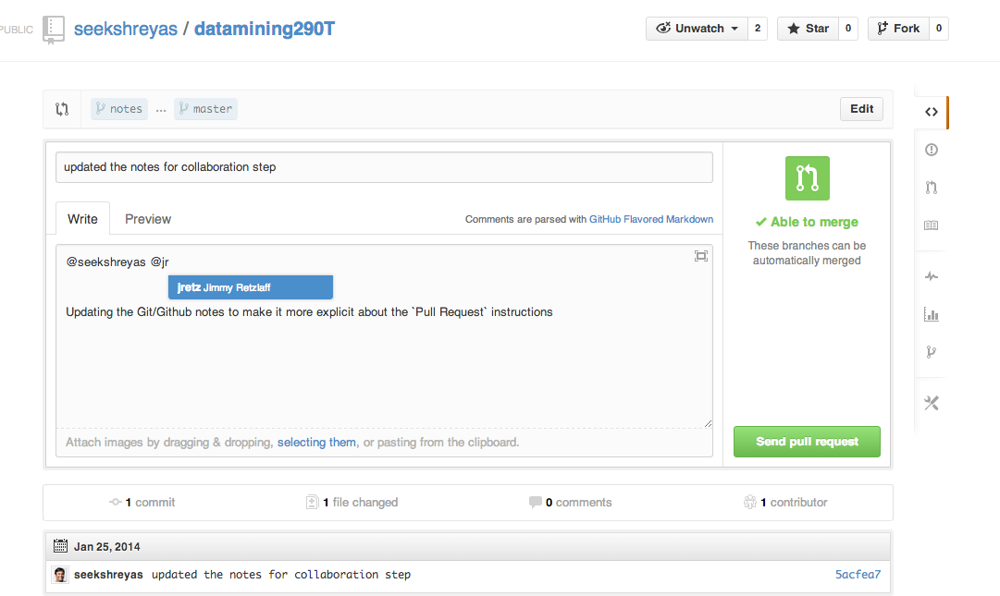

Your Workflow
=============

Below, I describe your general workflow for working in sync with the course repository and your own github repository.

Here, 

- [Course Repo] refers to Prof. Jimmy's course repository at: [github.com/jretz/datamining290](https://github.com/jretz/datamining290)
- [Your Repo] refers to your __private__ repository that you have created for checking in your work. So, for me it refers to : [github.com/seekshreyas/datamining290T](https://github.com/seekshreyas/datamining290T)
- [Local Repo] refers to the repository cloned on your local machine where you would be working from whether it is your machine or the ISchool server machine

Workflow Tasks:

- Pull latest updates from [Course Repo], and update [Your Repo]
- __Start__ your HomeWork
- __Submit__ your HomeWork


## Pull latest updates from [Course Repo], and update [Your Repo]

You should:

1. go to the master branch on your [Local Repo]
2. pull the latest content from the master branch of [Course Repo]
3. push the latest content from the [Local Repo] to [Your Repo]

To do this follow these commands:

```
$ cd <Course Repo Folder>
$ git checkout master
$ git pull origin master
$ git pull jimmy master
$ git push origin master
```

## Start your HomeWork

You should:

1. Sync [Your Repo] with [Course Repo] as above
2. Go to `master` branch on your [Local Repo]
3. Create a new branch to work on your homework
    - __NOTE__: __Do Not__ merge your homework branch with `master` or any other branch

To do this follow these commands:
```
# update and sync your repo first as above, then
$ git checkout master

# create and go to the new branch named: hw<HW_INDEX>-<HW_NAME>, like:
$ git checkout -b hw1-intro
```

## Submit your Homework

To submit your homework, click on the __Open a Pull Request__ button, on [Your Repo] page on Github. Fill in your submission comments and submit it.

1. Once you have pushed in your changes [Your Repo] on Github in the homework branch (i.e. `hw1-intro`), you might see a button like this on your repository page:


__Click__ on __Compare & pull request__

2. Fill out the pull request form, as shown below, and submit it. 



__Click__ on __Send pull request__

... and you're done :)

#### A __quick tip__

You can refer to users on github anywhere using `@<username>` syntax. So you can add `@jretz` for Jimmy and `@seekshreyas` for me in your comments which would send us notifications.


[Course Repo]: https://github.com/jretz/datamining290
[Your Repo]: https://github.com/seekshreyas/datamining290T
